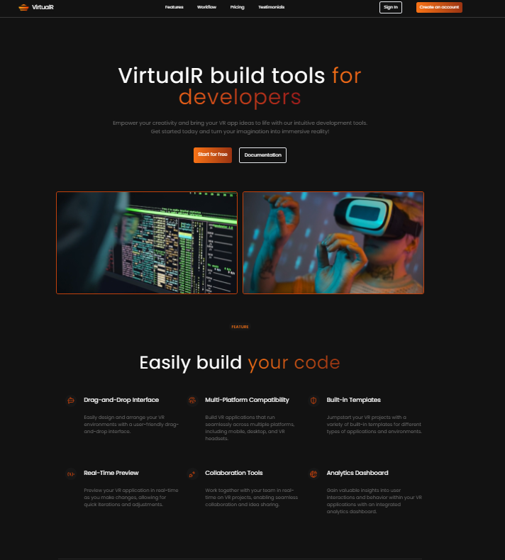

# VirtualR

## Description
VirtualR is a virtual reality application designed to show power of tailwind framework.

## Table of Contents
- [Screenshot](#screenshot)
- [Installation](#installation)
- [Usage](#usage)
- [Features](#features)
- [Testimonials](#testimonials)
- [Pricing](#pricing)
- [Links](#links)


## Screenshot


## Installation
To install and run this project locally, follow these steps:

1. Clone the repository:
    ```bash
    git clone https://github.com/nourmohamed45/virtualr.git
    cd virtualr
    ```

2. Install dependencies:
    ```bash
    npm install
    ```

3. Run the development server:
    ```bash
    npm run dev
    ```

4. Build for production:
    ```bash
    npm run build
    ```

5. Preview the build:
    ```bash
    npm run preview
    ```

## Usage
Once the development server is running, open your browser and navigate to `http://localhost:3000` to see the application in action.

## Features
- **Drag-and-Drop Interface**: Easily design and arrange your VR environments.
- **Multi-Platform Compatibility**: Build VR applications for mobile, desktop, and VR headsets.
- **Built-in Templates**: Start with a variety of templates for different VR applications.
- **Real-Time Preview**: See changes in real-time as you develop.
- **Collaboration Tools**: Work with your team in real-time.
- **Analytics Dashboard**: Gain insights into user interactions and behavior.

## Testimonials
### John Doe
**Company**: Stellar Solutions  
"I am extremely satisfied with the services provided. The team was responsive, professional, and delivered results beyond my expectations."

### Jane Smith
**Company**: Blue Horizon Technologies  
"I couldn't be happier with the outcome of our project. The team's creativity and problem-solving skills were instrumental in bringing our vision to life."

...

## Pricing
### Free
- Private board sharing
- 5 Gb Storage
- Web Analytics
- Private Mode

### Pro
- Private board sharing
- 10 Gb Storage
- Web Analytics (Advance)
- Private Mode

### Enterprise
- Private board sharing
- Unlimited Storage
- High Performance Network
- Private Mode

## Links
### Resources
- [Getting Started](#)
- [Documentation](#)
- [Tutorials](#)
- [API Reference](#)
- [Community Forums](#)

### Platform
- [Features](#)
- [Supported Devices](#)
- [System Requirements](#)
- [Downloads](#)
- [Release Notes](#)

### Community
- [Events](#)
- [Meetups](#)
- [Conferences](#)
- [Hackathons](#)
- [Jobs](#)


